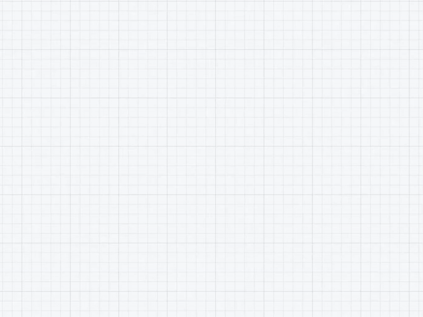

<h1 align="center">Weave</h1>

A pure-web node-based graph editor — freely place nodes, drag sockets to connect them, and build mind maps, flowcharts and logic trees.

<h2>Get started</h2>

  

1. **Use online** — open [quan-chan.github.io/Weave](https://quan-chan.github.io/Weave/) and use it directly; no download needed
2. **Download** — download `APPs/Weave.html`, the only application file; no installation needed
3. **Open** — open it in any modern browser (Chrome / Edge / Firefox / Safari)
4. **Use** — double-click the canvas to create a node, drag sockets to connect nodes, double-click text to edit it inline

<h2>Features</h2>

- **Nodes** — add, delete, select (click / box-select / multi-select), drag to move, inline editing, copy & paste
- **Connections** — create by dragging sockets, delete, edit labels, custom Bézier curve adjustments
- **Regions** — draw a region frame (Region key / Alt+drag), move it with its contained nodes, edit name/color or delete via right-click, nodes dragged in are owned automatically
- **Collapse chains** — click the − badge on a node's output socket to collapse the chain after it, + to expand; nesting supported
- **Linked highlight** — hold Alt and click a node to highlight its directly linked nodes and connections, with a slight blur on everything else
- **Canvas** — pan (drag / middle button), wheel zoom, fit view, editable coordinate HUD
- **Colors** — 5 presets + custom color-wheel picker, Ctrl+wheel to cycle quickly
- **Import / Export** — JSON import/export (with viewport info), PNG export, drag-and-drop JSON import
- **More** — undo/redo (up to 50 steps), read-only mode, auto-save to localStorage, focus mode (Ctrl+H), language switch (中文 / English) in Settings, customizable keybindings (shown on first launch)

<h2>Tech stack</h2>

Weave is built with pure front-end technologies — no frameworks, no dependencies, no build step. One HTML file is the whole product:

- **Plain JavaScript** — all logic inlined in a single file; the source is the product
- **HTML5 + CSS3** — semantic structure + CSS variables theme
- **Canvas 2D** — grid background and connection lines, re-rendered smoothly while panning/zooming
- **SVG** — overlay layer for Bézier control handles and connection labels with precise interaction
- **localStorage** — canvas data persists automatically across refreshes

<h2>Performance test data</h2>

Two test archives are bundled for performance stress-testing. Load them in Weave via **Import** (the JSON import button, or drag-and-drop the file onto the canvas):

- **`test/samples/weave_250_nodes.json`** — a regular graph with 250 nodes and 465 connections
- **`test/samples/weave_250_fullmesh.json`** — a full-mesh graph with 250 nodes and 62,250 connections, for extreme stress-testing

<h2>License</h2>

Open-sourced under the <a href="LICENSE">Apache License 2.0</a>.

<pre>Copyright © 2026 Quan-Chan</pre>
